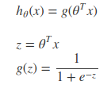
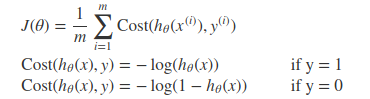
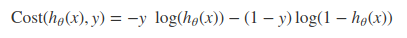
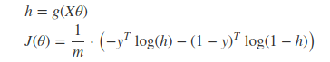
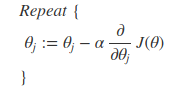
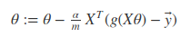
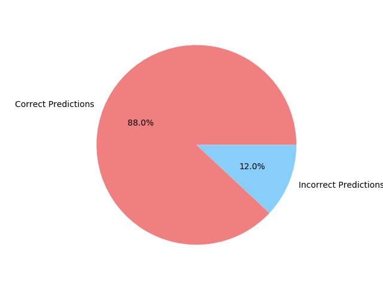
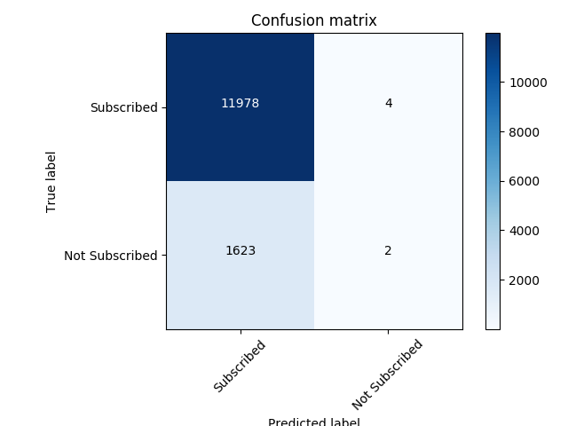
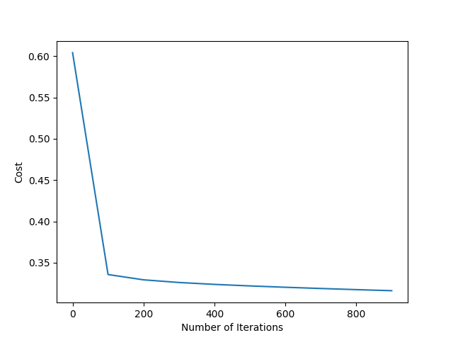

## Logistic Regression on Portugese Banking Dataset
# Logistic Regression:
Logistic Regression is a regression model where the dependent variable is categorical. In our project, the dependent variable is binary, hence indicating a Binary Classifier form of logistic regression. In binary classification, the dependent variable can take up only two values, ‘0’ or ‘1’. Such a representation is indicative of tackling problems such as pass/fail, accepted/rejected and so on.

Sigmoid function-
The output vector will only be 0 or 1 i.e. y∈{0,1}. The hypothesis function h(x) must satisfy 0<h(x)<1. In order to map h(x) to the interval (0,1) we use the sigmoid function, also known as the logistic function.

The function g(z) known as the sigmoid function, maps any real number to the (0,1) interval. We use sigmoid function to determine the probability of the output given a particular input.

Cost Function-

The cost function for the logistic regression is as follows-

The above two forms of the cost function can be clubbed into one single equation as shown below,

Vectorized implementation is as shown below,

Gradient Descent-

General form of gradient descent,

Vectorized implementation,

Features used for Banking Dataset:

| Features   |      Description      |
|----------|:-------------:|
| Age |  (numeric) |
| Job |    type of job (categorical: 'admin.','blue-collar','entrepreneur','housemaid','management','retired','self-employed','services','student','technician','unemployed','unknown')   |
| Marital | marital status (categorical: 'divorced','married','single','unknown'; note: 'divorced' means divorced or widowed) |
| Education |  (categorical:'basic.4y','basic.6y','basic.9y','high.school','illiterate','professional.course','university.degree','unknown')|
| Defaulter |  has credit in default? (categorical: 'no','yes','unknown') |
| Housing |  has housing loan? (categorical: 'no','yes','unknown')|
| Loan |  has personal loan? (categorical: 'no','yes','unknown') |
| Contact |  contact communication type (categorical: 'cellular','telephone') |
| Duration |  last contact duration, in seconds (numeric).|
| Campaign |  number of contacts performed during this campaign and for this client (numeric, includes last contact) |
| Pdays |  number of days that passed by after the client was last contacted from a previous campaign |
| Previous |  number of contacts performed before this campaign and for this client (numeric) |
| Poutcome |  outcome of the previous marketing campaign (categorical: 'failure','nonexistent','success') |

Logistic Regression Accuracy-

Confusion Matrix-

Cost vs Number of Iterations -

Implementation in Spark ML Lib Logistic Regression Model -
PySpark Implementation: [Link](https://github.com/naveendennis/LogisticRegression-using-Spark-with-MLlib/blob/master/LogisticRegressionWithMLlib.ipynb)

Links to other models -
Naveen Dennis Barnabas - [K-Means](https://github.com/naveendennis/LogisticRegression-using-Spark-with-MLlib/blob/master/KMeansClustering.ipynb)
Aditya Kumar - [KNN]()
